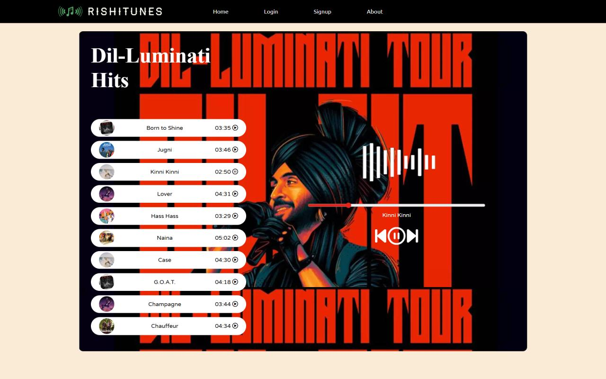
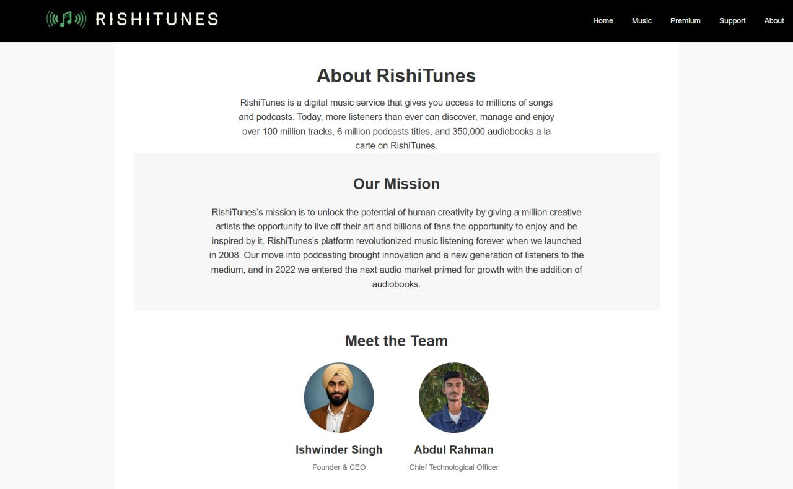

# RishiTunes

A web-based music player application that lets you play, pause, and manage your favorite tracks with a clean and intuitive interface.

## Features

- **Play/Pause Music** - Control playback with a single click
- **Track Navigation** - Previous and next track buttons with playlist looping
- **Progress Bar** - Seek to any position in the song
- **Song List** - Browse and select from 10 trending Punjabi/Hindi hits
- **Dynamic Cover Art** - Album art displayed for each track
- **Responsive Design** - Works on desktop and mobile devices
- **User Authentication** - Login and signup pages for user management

## Tech Stack

- **HTML5** - Structure
- **CSS3** - Styling (responsive design)
- **JavaScript** - Audio playback logic
- **Font Awesome** - Icons

## Project Structure

```
RishiTunes/
├── index.html          # Main music player page
├── login.html          # User login page
├── signup.html         # User registration page
├── About.html          # About the project
├── script.js           # Audio player logic
├── style.css           # Main stylesheet
├── loginstyle.css      # Login page styles
├── signupstyle.css     # Signup page styles
├── About.css           # About page styles
├── logo.png            # Brand logo
├── player.gif          # Animated player visual
├── bg.jpg              # Background image
├── songs/              # Audio files (1.mp3 - 10.mp3)
└── covers/             # Album cover images (1.png, 2-10.jpg)
```

## Songs Included

1. Born to Shine
2. Jugni
3. Kinni Kinni
4. Lover
5. Hass Hass
6. Naina
7. Case
8. G.O.A.T.
9. Champagne
10. Chauffeur

## UI Interface

### Home Page - Music Player


### About Page



1. Clone the repository
2. Open `index.html` in your web browser
3. Click on any song to start playing
4. Use the player controls to manage playback

## Browser Support

- Chrome (recommended)
- Firefox
- Safari
- Edge

## License

This project is for educational purposes. All audio files and images are property of their respective owners.